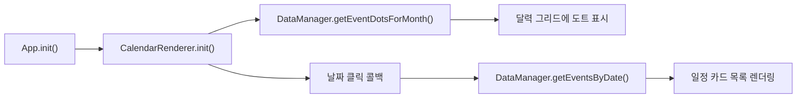

# 모바일 웹 캘린더 — 구현 워크스루

## 프로젝트 구조

```
WebCalander/
├── index.html              ← 진입점
├── css/
│   ├── variables.css       ← 디자인 토큰 (색상, 폰트, 간격)
│   ├── layout.css          ← 전체 레이아웃 (리셋, 헤더, 앱 셸)
│   └── calendar.css        ← 캘린더 세부 스타일 (그리드, 카드)
└── js/
    ├── data.js             ← 데이터 관리 (Mock 데이터)
    ├── calendar.js         ← 달력 렌더링 엔진
    └── app.js              ← 메인 컨트롤러
```

## 모듈별 역할

### CSS 계층

| 파일 | 역할 |
|------|------|
| [variables.css](file:///Users/sonny/WebCalander/css/variables.css) | CSS 커스텀 프로퍼티로 전역 디자인 토큰 관리. 색상 변경 시 이 파일만 수정하면 전체 테마가 바뀜 |
| [layout.css](file:///Users/sonny/WebCalander/css/layout.css) | 리셋, 앱 셸 (max-width 430px, 가운데 정렬), 헤더, 스크롤 영역 |
| [calendar.css](file:///Users/sonny/WebCalander/css/calendar.css) | 7열 그리드, 날짜 셀, 오늘/선택 상태, 일정 카드, 슬라이드 애니메이션 |

### JS 계층

| 파일 | 역할 | 패턴 |
|------|------|------|
| [data.js](file:///Users/sonny/WebCalander/js/data.js) | Mock 일정 데이터 제공 및 날짜별 필터링 | IIFE 모듈 (`DataManager`) |
| [calendar.js](file:///Users/sonny/WebCalander/js/calendar.js) | 날짜 계산, 그리드 셀 생성, 이전/다음 월 이동 | IIFE 모듈 (`CalendarRenderer`) |
| [app.js](file:///Users/sonny/WebCalander/js/app.js) | DOM 초기화, 이벤트 바인딩, 일정 목록 렌더링, 스와이프 | IIFE 모듈 (`App`) |

## 데이터 흐름



## 주요 기능

- **월간 달력**: 6주(42칸) 그리드로 이전/다음 달 날짜 포함
- **오늘 표시**: 코발트 블루 원형 하이라이트 + glow 효과
- **날짜 선택**: 탭하면 해당 날짜의 일정이 하단에 표시
- **월 이동**: `‹` / `›` 버튼 또는 터치 스와이프 (좌/우)
- **일정 도트**: 각 날짜에 최대 3개의 색상 도트로 일정 유무 표시
- **일정 카드**: 시간, 제목, 위치를 카테고리 색상 바와 함께 표시
- **다크 모드**: 어두운 남색 계열 배경
- **설정 메뉴**: 상단 메뉴 버튼(햄버거 아이콘)을 통한 드롭다운 메뉴 (전환 효과 등 기능 확장용)

## 확장 방향

- `data.js`의 내부 구현만 교체하면 Google Calendar API 등 실제 데이터 소스 연동 가능
- 일정 추가/편집은 향후 `js/editor.js` 모듈과 `css/editor.css`를 추가하여 구현
